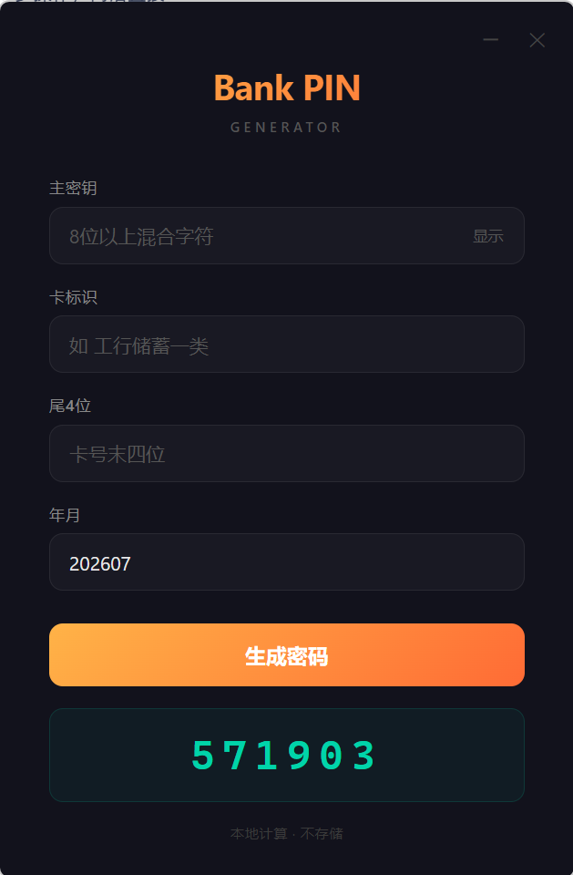
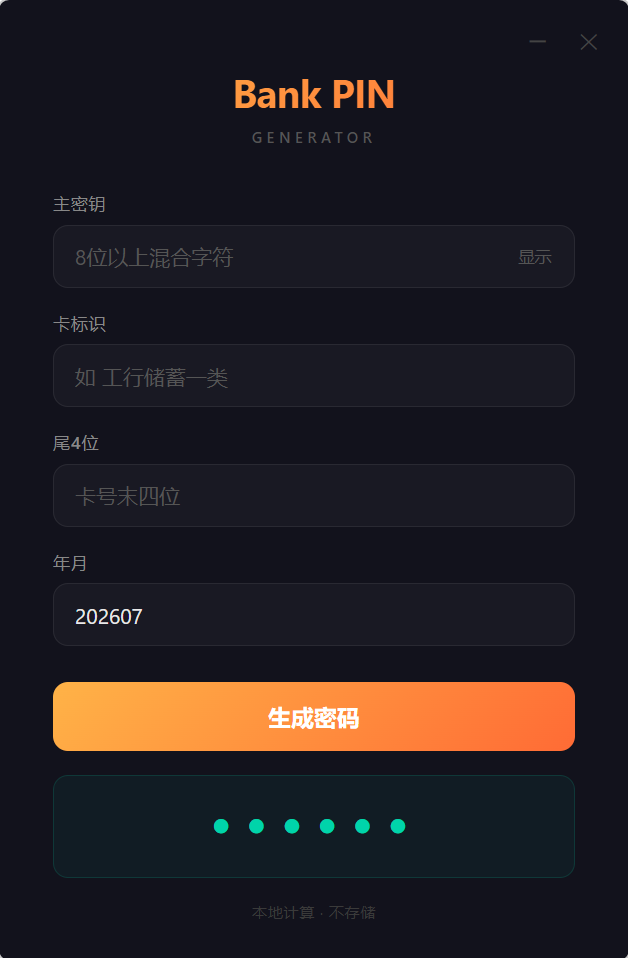

---
AIGC:
  ContentProducer: '001191110102MAD55U9H0F10002'
  ContentPropagator: '001191110102MAD55U9H0F10002'
  Label: '1'
  ProduceID: '5af0737d-4e22-456c-9621-a63e3d1859de'
  PropagateID: '5af0737d-4e22-456c-9621-a63e3d1859de'
  ReservedCode1: '256c17f9-f36b-4365-bae8-c2a98ccedca7'
  ReservedCode2: '256c17f9-f36b-4365-bae8-c2a98ccedca7'
---

# Bank PIN Generator

A minimal, offline desktop tool for deriving bank card PINs from a master key — no storage, no network, no state.

Same inputs always produce the same PIN. Lose your phone? Re-derive from memory.

Human-memorable password schemes (Vigenere, modular arithmetic, etc.) are inherently vulnerable to known-plaintext attacks — once a PIN is exposed, the algorithm can be reverse-engineered. This tool replaces mental math with cryptographic primitives (PBKDF2 + HMAC-SHA256) to eliminate that attack surface entirely.

<!-- |  |  | -->

<!-- |:-------------------------------------------:|:-------------------------------------------:| -->

<!-- | screenshot_1                                | screenshot_2                                | -->

## How It Works

|  |  |  |
|:-------------------------------------------:|:-------------------------------------------:|:-------------------------------------------:|
| screenshot_1                                | screenshot_2                                | screenshot_3    |

You remember **one master key**. The app combines it with card-specific inputs and runs them through a cryptographic pipeline to produce a 6-digit PIN:

```
Master Key ──PBKDF2(1M iterations)──→ Stretched Key
                                           │
Card Label ─┐                              ▼
Last 4    ──┼── Structured Message ──→ HMAC-SHA256 ──→ 6-digit PIN
Period    ──┘                        (rejection sampling + weak filter)
```

**Same four inputs → same PIN. Always.**

## Security Model

- **No storage.** The app holds nothing — no passwords, no history, no config files. Close it and nothing remains.
- **No network.** CSP enforces `connect-src 'none'`. The app cannot make any network request, period.
- **Master key is the only secret.** The algorithm, salt, and message format are all public. Security relies entirely on your master key — per [Kerckhoffs's principle](https://en.wikipedia.org/wiki/Kerckhoffs%27s_principle).
- **PBKDF2 with 1,000,000 iterations.** An 8-character mixed key takes ~50,000 years to brute-force on a modern GPU.
- **Sharing the app or source code is completely safe.** Your master key exists only in your head.

## Weak PIN Filtering

Generated PINs are filtered against rules derived from major Chinese bank security standards:

1. **No repeated digits** — all 6 digits must be unique
2. **No sequential digits** — ascending or descending, including wrap-around (e.g. `890123`, `109876`)
3. **No date patterns** — `YYMMDD`, `MMDDYY`, `DDMMYY` (valid month + day)
4. **No keyboard lines** — any 3 consecutive digits on the same ATM/phone keypad line (rows, columns, diagonals)

If a candidate PIN hits any rule, the next hash segment is used. ~72% of candidates pass on the first try.

## Usage

1. Launch `BankPinGenerator.exe`
2. Enter your **master key** (8+ characters recommended)
3. Enter a **card label** (e.g. `工行储蓄一类`)
4. Enter the card's **last 4 digits**
5. Enter the **period** (auto-filled with current month, change for rotation)
6. Click **Generate** — PIN appears, all inputs are cleared

Click the PIN to toggle visibility. It auto-hides when the window loses focus.

## Download

| File                                   | Size   | Description                                  |
| -------------------------------------- | ------ | -------------------------------------------- |
| `BankPinGenerator.exe`                 | 2.6 MB | Run directly on Windows 10/11 with WebView2  |
| `BankPinGenerator_1.0.0_x64-setup.exe` | 1 MB   | NSIS installer, downloads WebView2 on demand |

## Build from Source

Prerequisites:

- [Rust](https://rustup.rs/) (MSVC toolchain)
- WebView2 (pre-installed on Windows 10/11)

```bash
cargo install tauri-cli
cd src-tauri
cargo tauri build
```

## Tech Stack

| Layer    | Choice                                |
| -------- | ------------------------------------- |
| Shell    | Tauri 2                               |
| Frontend | Vanilla HTML/CSS/JS                   |
| Backend  | Rust                                  |
| Crypto   | Web Crypto API (PBKDF2 + HMAC-SHA256) |
| Build    | Cargo + NSIS                          |

## License

For educational purposes only.

> AI生成
